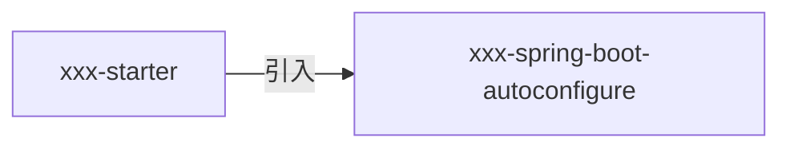
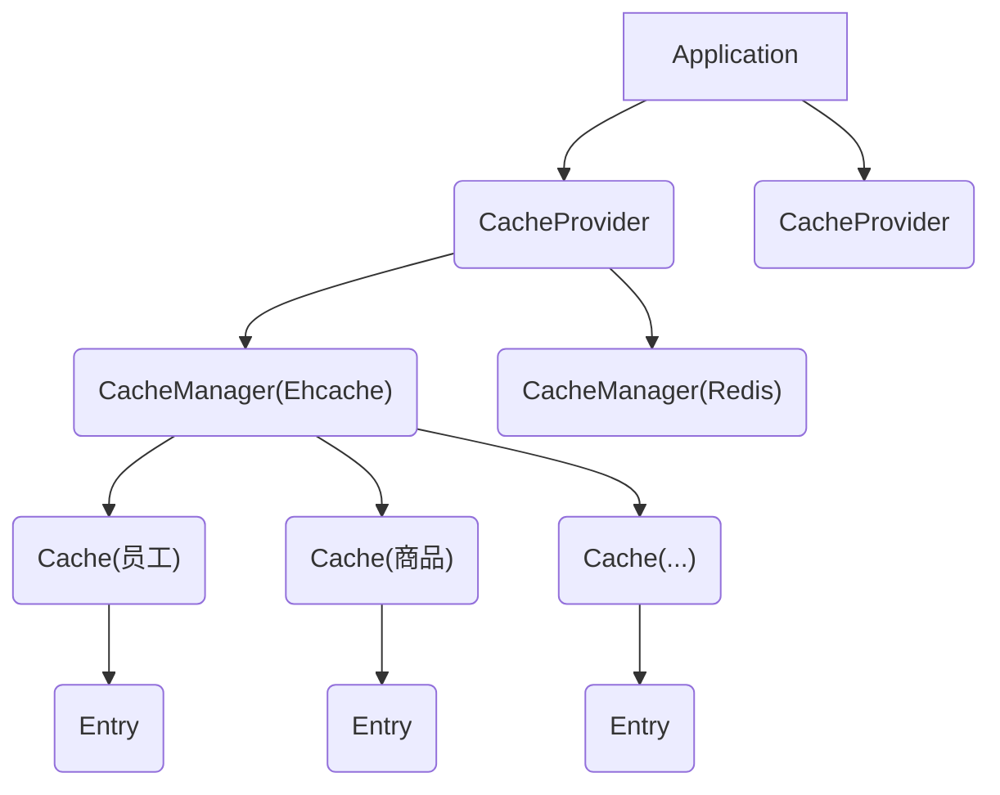

草稿

<!--more-->

# 一 准备

## 1. 环境

java version 1.8

spring boot Version 2.0.3

## 2. 官方文档

http://spring.io/projects/spring-boot

https://docs.spring.io/spring-boot/docs/2.0.3.RELEASE/reference/htmlsingle/

## 3. 项目生成器

https://start.spring.io/

# 二 spring boot helloworld

## 1. 创建

### 1.1 生成pom文件

```xml
<?xml version="1.0" encoding="UTF-8"?>
<project xmlns="http://maven.apache.org/POM/4.0.0" xmlns:xsi="http://www.w3.org/2001/XMLSchema-instance"
	xsi:schemaLocation="http://maven.apache.org/POM/4.0.0 http://maven.apache.org/xsd/maven-4.0.0.xsd">
	<modelVersion>4.0.0</modelVersion>

	<groupId>top.luckie</groupId>
	<artifactId>mservice</artifactId>
	<version>0.0.1-SNAPSHOT</version>
	<packaging>jar</packaging>

	<name>demo</name>
	<description>Demo project for Spring Boot</description>

	<parent>
		<groupId>org.springframework.boot</groupId>
		<artifactId>spring-boot-starter-parent</artifactId>
		<version>2.0.3.RELEASE</version>
		<relativePath/> 
	</parent>

	<properties>
		<project.build.sourceEncoding>UTF-8</project.build.sourceEncoding>
		<project.reporting.outputEncoding>UTF-8</project.reporting.outputEncoding>
		<java.version>1.8</java.version>
	</properties>

	<dependencies>
		<dependency>
			<groupId>org.springframework.boot</groupId>
			<artifactId>spring-boot-starter-web</artifactId>
		</dependency>

		<dependency>
			<groupId>org.springframework.boot</groupId>
			<artifactId>spring-boot-starter-test</artifactId>
			<scope>test</scope>
		</dependency>
	</dependencies>

	<build>
		<plugins>
			<plugin>
				<groupId>org.springframework.boot</groupId>
				<artifactId>spring-boot-maven-plugin</artifactId>
			</plugin>
		</plugins>
	</build>

</project>
```

### 1.2 启动类

Application.java

```java
@SpringBootApplication
public class Application {

	public static void main(String[] args) {
		SpringApplication.run(DemoApplication.class, args);
	}
}
```

### 1.3 controller

```java
import org.springframework.stereotype.Controller;
import org.springframework.web.bind.annotation.RequestMapping;
import org.springframework.web.bind.annotation.ResponseBody;

@Controller
public class HelloController {
	
	@RequestMapping("/")
    @ResponseBody
	public String hello() {
		return "hello world";
	}
}
```

##2.运行

1) 执行启动类的main方法

2) 在浏览器输入地址:http://127.0.0.1:8080/


# 日志配置 


https://logback.qos.ch/manual/layouts.html

格式说明如下：

| %m   | 输出代码中指定的消息                                         |
| ---- | ------------------------------------------------------------ |
| %p   | 输出优先级，即DEBUG，INFO，WARN，ERROR，FATAL                |
| %r   | 输出自应用启动到输出该log信息耗费的毫秒数                    |
| %c   | 输出所属的类目，通常就是所在类的全名                         |
| %t   | 输出产生该日志事件的线程名                                   |
| %n   | 输出一个回车换行符，Windows平台为“\r\n”，Unix平台为“\n”      |
| %d   | 输出日志时间点的日期或时间，默认格式为ISO8601，也可以在其后指定格式，比如：%d{yyy MMM dd HH:mm:ss,SSS}，输出类似：2002年10月18日 22：10：28，921 |
| %l   | 输出日志事件的发生位置，包括类目名、发生的线程，以及在代码中的行数。举例：Testlog4.main(TestLog4.java:10) |

logger参数

| Format modifier | Logger name           | Result                   |
| --------------- | --------------------- | ------------------------ |
| [%20.20logger]  | main.Name             | `[           main.Name]` |
| [%-20.20logger] | main.Name             | `[main.Name           ]` |
| [%10.10logger]  | main.foo.foo.bar.Name | `[o.bar.Name]`           |
| [%10.-10logger] | main.foo.foo.bar.Name | `[main.foo.f]`           |

示例

```properties
logging.level.top.luckie=debug

#格式
logging.pattern.console=%d{HH:mm:ss.SSS} %logger{10} - %msg
#logging.pattern.file==%d{yyyy-MM-dd HH:mm:ss.SSS} [%thread] %-5level %logger{50} - %msg

#目录和地址二选一
#指定目录
#logging.pth=/opt/log/demo
#指定文件
#logging.file=/opt/log/demo.log
```


# 三.spring boot mvc

## 1.配置

### 1. 自动配置处理类

```java
org.springframework.boot.autoconfigure.web.servlet.WebMvcAutoConfiguration
```

### 2. 自定义配置

#### 1) 说明

f you want to keep Spring Boot MVC features and you want to add additional [MVC configuration](https://docs.spring.io/spring/docs/5.0.7.RELEASE/spring-framework-reference/web.html#mvc) (interceptors, formatters, view controllers, and other features), you can add your own `@Configuration` class of type `WebMvcConfigurer` but **without** `@EnableWebMvc`. If you wish to provide custom instances of`RequestMappingHandlerMapping`, `RequestMappingHandlerAdapter`, or `ExceptionHandlerExceptionResolver`, you can declare a`WebMvcRegistrationsAdapter` instance to provide such components.

If you want to take complete control of Spring MVC, you can add your own `@Configuration` annotated with `@EnableWebMvc`.

#### 2) 编写配置类

1) 编写配置类覆盖WebMvcConfigurer里的方法

```java
@Configuration
public class MyMvcConfig implements WebMvcConfigurer {
	...
}

```

#### 3) 全局映射

```java
public void addViewControllers(ViewControllerRegistry registry) {
	registry.addViewController("/").setViewName("login");
    registry.addViewController("/index.html").setViewName("login");
}
```

#### 4) 拦截器

```java
public void addInterceptors(InterceptorRegistry registry) {
	registry.addInterceptor(new LogInterceptor()).addPathPatterns("/**")
		.excludePathPatterns("/webjars/**");
	registry.addInterceptor(new PermissionInterceptor()).addPathPatterns("/**")
		.excludePathPatterns("/webjars/**","/","/login","/index.html","/logout");
}
```

#### 5) 异常处理

##### 系统规则

```java
org.springframework.boot.autoconfigure.web.servlet.error.ErrorMvcAutoConfiguration
```

1. ErrorPageCustomizer:将所有错误请求转发到/error

```java
public class ErrorProperties {
	@Value("${error.path:/error}")
	private String path = "/error";
```

2. BasicErrorController: 处理/error

   根据html和json返回不同内容

```java
@Controller
@RequestMapping("${server.error.path:${error.path:/error}}")
public class BasicErrorController extends AbstractErrorController {
	@RequestMapping(produces = "text/html")
	public ModelAndView errorHtml(HttpServletRequest request,
			HttpServletResponse response) {
		HttpStatus status = getStatus(request);
		Map<String, Object> model = Collections.unmodifiableMap(getErrorAttributes(
				request, isIncludeStackTrace(request, MediaType.TEXT_HTML)));
		response.setStatus(status.value());
        
        //去向
		ModelAndView modelAndView = resolveErrorView(request, response, status, model);
		return (modelAndView != null ? modelAndView : new ModelAndView("error", model));
	}

	@RequestMapping
	@ResponseBody
	public ResponseEntity<Map<String, Object>> error(HttpServletRequest request) {
		Map<String, Object> body = getErrorAttributes(request,
				isIncludeStackTrace(request, MediaType.ALL));
		HttpStatus status = getStatus(request);
		return new ResponseEntity<>(body, status);
	}
```

```

```

3. DefaultErrorViewResolver:决定最终返回的错误页面

```java
private ModelAndView resolve(String viewName, Map<String, Object> model) {
	//默认返回 error/状态码	
    String errorViewName = "error/" + viewName;
    
    //如果有模板直接返回对应的模板视图,否则返回静态资源("error/状态码.html)
	TemplateAvailabilityProvider provider = this.templateAvailabilityProviders
				.getProvider(errorViewName, this.applicationContext);
	if (provider != null) {
		return new ModelAndView(errorViewName, model);
	}
	return resolveResource(errorViewName, model);
}
```

4. DefaultErrorAttributes:存放异常信息

```java
import org.springframework.boot.web.servlet.error.DefaultErrorAttributes;
@Override
	public Map<String, Object> getErrorAttributes(ServerRequest request,
			boolean includeStackTrace) {
		Map<String, Object> errorAttributes = new LinkedHashMap<>();
		errorAttributes.put("timestamp", new Date());
		errorAttributes.put("path", request.path());
		Throwable error = getError(request);
		HttpStatus errorStatus = determineHttpStatus(error);
		errorAttributes.put("status", errorStatus.value());
		errorAttributes.put("error", errorStatus.getReasonPhrase());
		errorAttributes.put("message", determineMessage(error));
		handleException(errorAttributes, determineException(error), includeStackTrace);
		return errorAttributes;
	}
```


##### 根据规则添加页面

/template/404.html,4xx.html,5xx.html

```html
status:[[${status}]]<br/>
timestamp:[[${timestamp}]]<br/>
error:[[${error}]]<br/>
message:[[${message}]]<br/>
status:[[${status}]]<br/>
path:[[${path}]]<br/>
```

##### 自定义异常返回内容

通过继承DefaultErrorAttributes创建自己的ErrorAttributes,重写getErrorAttributes方法

```java
@Component
public class MyErrorAttributes extends DefaultErrorAttributes{

	@Override
	public Map<String, Object> getErrorAttributes(WebRequest webRequest,
			boolean includeStackTrace) {
		
		Map<String, Object> errorAttributes = super.getErrorAttributes(webRequest, true);
		errorAttributes.put("custom", "自定义信息");
		return errorAttributes;
	}
}
```

##### 替换默认的ErrorController

```java
//全局异常处理类
@RestController
@ControllerAdvice
public class MyErrorController extends BaseController implements ErrorController {

    @ResponseBody
    @RequestMapping("/error")
    public Object error(HttpServletRequest request, HttpServletResponse httpServletResponse) {
        ErrorInfo errorInfo=createError(request);
        if("application/json".equalsIgnoreCase(errorInfo.getContentType())){
            return errorInfo;
        }
        return $("error/404",errorInfo);
    }

    @ExceptionHandler()
    @ResponseBody
    public Object handleException(HttpServletRequest request, Exception e){
        ErrorInfo errorInfo=createError(request);
        errorInfo.setError(LogUtil.getExceptionText(e));
        if("application/json".equalsIgnoreCase(errorInfo.getContentType())){
            errorInfo.setError(e.getMessage());
            return errorInfo;
        }
        return $("error/500",errorInfo);
    }

    protected HttpStatus getStatus(HttpServletRequest request) {
        Integer statusCode = (Integer)request.getAttribute("javax.servlet.error.status_code");
        if (statusCode == null) {
            return HttpStatus.INTERNAL_SERVER_ERROR;
        } else {
            try {
                return HttpStatus.valueOf(statusCode);
            } catch (Exception var4) {
                return HttpStatus.INTERNAL_SERVER_ERROR;
            }
        }
    }

    private ErrorInfo createError(HttpServletRequest request){
        HttpStatus status = this.getStatus(request);
        ErrorInfo errorInfo=new ErrorInfo();
        errorInfo.setStatus(status.value());
        errorInfo.setStatusMessage(status.getReasonPhrase());
        errorInfo.setPath(request.getRequestURI());
        errorInfo.setContentType(request.getContentType());
        errorInfo.setTimestamp(DateTime.current()+"");
        return errorInfo;
    }

    /**
     * 实现错误路径,暂时无用
     */
    @Override
    public String getErrorPath() {
        return "";
    }

}
```


## 2 静态文件映射规则

https://www.webjars.org/

### 1) webjars 

/webjars/-->classPath:/META-INF/resources/webjars/

```xml
<dependency>
	<groupId>org.webjars</groupId>
	<artifactId>bootstrap</artifactId>
	<version>4.1.1</version>
</dependency>
```


bootstrap文件访问地址如下:

http://127.0.0.1:8080/webjars/bootstrap/4.1.1/js/bootstrap.min.js

### 2)静态文件

```java
"classpath:/META-INF/resources/", 
"classpath:/resources/",
"classpath:/static/", 
"classpath:/public/"
"/"
```

## 3 模板引擎(Thymeleaf)

### 1) pom

```xml
<dependency>
    <groupId>org.springframework.boot</groupId>
    <artifactId>spring-boot-starter-thymeleaf</artifactId>
</dependency>
```

### 2) 默认规则

自动配置类

```java
org.springframework.boot.autoconfigure.thymeleaf.ThymeleafAutoConfiguration
```

映射规则xxx-->classpath:/templates/xxx.html

```java
@ConfigurationProperties(prefix = "spring.thymeleaf")
public class ThymeleafProperties {

	private static final Charset DEFAULT_ENCODING = StandardCharsets.UTF_8;

	public static final String DEFAULT_PREFIX = "classpath:/templates/";

	public static final String DEFAULT_SUFFIX = ".html";
```

# 四. spring boot 访问数据库

## 1. 数据源

### 1) pom.xml

```xml
<dependency>
    <groupId>com.alibaba</groupId>
    <artifactId>druid</artifactId>
    <version>1.1.8</version>
</dependency>

<dependency>
	<groupId>org.springframework</groupId>
	<artifactId>spring-jdbc</artifactId>
	<version>4.2.5.RELEASE</version>
</dependency>
```

2) 参数

| 配置                          | 缺省值             | 说明                                                         |
| ----------------------------- | ------------------ | ------------------------------------------------------------ |
| name                          |                    | 配置这个属性的意义在于，如果存在多个数据源，监控的时候可以通过名字来区分开来。  如果没有配置，将会生成一个名字，格式是："DataSource-" + System.identityHashCode(this) |
| jdbcUrl                       |                    | 连接数据库的url，不同数据库不一样。例如：  mysql : jdbc:mysql://10.20.153.104:3306/druid2  oracle : jdbc:oracle:thin:@10.20.149.85:1521:ocnauto |
| username                      |                    | 连接数据库的用户名                                           |
| password                      |                    | 连接数据库的密码。如果你不希望密码直接写在配置文件中，可以使用ConfigFilter。详细看这里：https://github.com/alibaba/druid/wiki/%E4%BD%BF%E7%94%A8ConfigFilter |
| driverClassName               | 根据url自动识别    | 这一项可配可不配，如果不配置druid会根据url自动识别dbType，然后选择相应的driverClassName(建议配置下) |
| initialSize                   | 0                  | 初始化时建立物理连接的个数。初始化发生在显示调用init方法，或者第一次getConnection时 |
| maxActive                     | 8                  | 最大连接池数量                                               |
| maxIdle                       | 8                  | 已经不再使用，配置了也没效果                                 |
| minIdle                       |                    | 最小连接池数量                                               |
| maxWait                       |                    | 获取连接时最大等待时间，单位毫秒。配置了maxWait之后，缺省启用公平锁，并发效率会有所下降，如果需要可以通过配置useUnfairLock属性为true使用非公平锁。 |
| poolPreparedStatements        | false              | 是否缓存preparedStatement，也就是PSCache。PSCache对支持游标的数据库性能提升巨大，比如说oracle。在mysql下建议关闭。 |
| maxOpenPreparedStatements     | -1                 | 要启用PSCache，必须配置大于0，当大于0时，poolPreparedStatements自动触发修改为true。在Druid中，不会存在Oracle下PSCache占用内存过多的问题，可以把这个数值配置大一些，比如说100 |
| validationQuery               |                    | 用来检测连接是否有效的sql，要求是一个查询语句。如果validationQuery为null，testOnBorrow、testOnReturn、testWhileIdle都不会其作用。 |
| testOnBorrow                  | true               | 申请连接时执行validationQuery检测连接是否有效，做了这个配置会降低性能。 |
| testOnReturn                  | false              | 归还连接时执行validationQuery检测连接是否有效，做了这个配置会降低性能 |
| testWhileIdle                 | false              | 建议配置为true，不影响性能，并且保证安全性。申请连接的时候检测，如果空闲时间大于timeBetweenEvictionRunsMillis，执行validationQuery检测连接是否有效。 |
| timeBetweenEvictionRunsMillis |                    | 有两个含义：  1) Destroy线程会检测连接的间隔时间2) testWhileIdle的判断依据，详细看testWhileIdle属性的说明 |
| numTestsPerEvictionRun        |                    | 不再使用，一个DruidDataSource只支持一个EvictionRun           |
| minEvictableIdleTimeMillis    |                    |                                                              |
| connectionInitSqls            |                    | 物理连接初始化的时候执行的sql                                |
| exceptionSorter               | 根据dbType自动识别 | 当数据库抛出一些不可恢复的异常时，抛弃连接                   |
| filters                       |                    | 属性类型是字符串，通过别名的方式配置扩展插件，常用的插件有：  监控统计用的filter:stat日志用的filter:log4j防御sql注入的filter:wall |
| proxyFilters                  |                    | 类型是List<com.alibaba.druid.filter.Filter>，如果同时配置了filters和proxyFilters，是组合关系，并非替换关系 |

 

```properties
spring.datasource.username=root
spring.datasource.password=123456
spring.datasource.url=jdbc:mysql://127.0.0.1:3306/jdbc
spring.datasource.driver-class-name=com.mysql.jdbc.Driver
spring.datasource.type=com.alibaba.druid.pool.DruidDataSource
spring.datasource.filters=stat,log4j,wall

```

配置数据源监控

```java
@Configuration
public class DruidConfig {
	
	@ConfigurationProperties(prefix="spring.datasource")
	@Bean
	public DataSource druid() {
		return new DruidDataSource();
	}
	
	//管理后台的servlet
	@Bean
	public ServletRegistrationBean<StatViewServlet> staViewServlet(){
		ServletRegistrationBean<StatViewServlet> bean= new ServletRegistrationBean<>(new StatViewServlet(),"/druid/*");
		Map<String,String> map=new HashMap<>();
		map.put(ResourceServlet.PARAM_NAME_USERNAME,"root");
		map.put(ResourceServlet.PARAM_NAME_PASSWORD,"123456");
		map.put(ResourceServlet.PARAM_NAME_ALLOW, "");//默认允许所有
		bean.setInitParameters(map);
		return bean;
	}
	//监控的filter
	@Bean
	public FilterRegistrationBean<WebStatFilter> webStaFilter() {
		FilterRegistrationBean<WebStatFilter> bean=new FilterRegistrationBean<>();
		bean.setFilter(new WebStatFilter());
		Map<String,String> map=new HashMap<>();
		map.put(WebStatFilter.PARAM_NAME_EXCLUSIONS, "*.js,*.css,/druid/*");
		bean.setInitParameters(map);		
		bean.setUrlPatterns(Arrays.asList("/*"));
		return bean;
	}
}

```

# 五 spring boot mybatis

# 六 spring boot 启动流程

## 1.启动流程

### 1).创建SpringApplication对象

​	获取ApplicationContextInitializer和ApplicationListener

所有jar包特定路径(META-INF/spring.factories)下的ApplicationContextInitializer

```java
public SpringApplication(ResourceLoader resourceLoader, Class<?>... primarySources) {
    this.resourceLoader = resourceLoader;
    Assert.notNull(primarySources, "PrimarySources must not be null");
    this.primarySources = new LinkedHashSet<>(Arrays.asList(primarySources));
    this.webApplicationType = deduceWebApplicationType();
    //在类路径下找到META-INF/spring.factories配置的所有ApplicationContextInitializer
    setInitializers((Collection) getSpringFactoriesInstances(
        ApplicationContextInitializer.class));
    //同样文件下再找ApplicationListener
    setListeners((Collection) getSpringFactoriesInstances(ApplicationListener.class));
    this.mainApplicationClass = deduceMainApplicationClass();
}
	
```

### 2)运行程序

```java
public ConfigurableApplicationContext run(String... args) {
    StopWatch stopWatch = new StopWatch();
    stopWatch.start();
    ConfigurableApplicationContext context = null;
    Collection<SpringBootExceptionReporter> exceptionReporters = new ArrayList<>();
    configureHeadlessProperty();
    //获取监听器
    SpringApplicationRunListeners listeners = getRunListeners(args);
    listeners.starting();
    try {
        ApplicationArguments applicationArguments = new DefaultApplicationArguments(
            args);
        ConfigurableEnvironment environment = prepareEnvironment(listeners,
                                                                 applicationArguments);
        configureIgnoreBeanInfo(environment);
        Banner printedBanner = printBanner(environment);
        //创建IOC容器
        context = createApplicationContext();
        exceptionReporters = getSpringFactoriesInstances(
            SpringBootExceptionReporter.class,
            new Class[] { ConfigurableApplicationContext.class }, context);
        //准备
        //执行所有ApplicationContextInitializer的Initial方法
        //执行ApplicationListener的prepare方法
        prepareContext(context, environment, listeners, applicationArguments,
                       printedBanner);
        //
        //扫描,创建,加载所有组件
        refreshContext(context);
        afterRefresh(context, applicationArguments);
        stopWatch.stop();
        if (this.logStartupInfo) {
            new StartupInfoLogger(this.mainApplicationClass)
                .logStarted(getApplicationLog(), stopWatch);
        }
        listeners.started(context);
        callRunners(context, applicationArguments);
    }
    catch (Throwable ex) {
        handleRunFailure(context, ex, exceptionReporters, listeners);
        throw new IllegalStateException(ex);
    }

    try {
        listeners.running(context);
    }
    catch (Throwable ex) {
        handleRunFailure(context, ex, exceptionReporters, null);
        throw new IllegalStateException(ex);
    }
    return context;
}
```

### 3)事件监听

1. 配置在META-INF/spring.factories

   ApplicationContextInitializer

   SpringApplicationRunListener

2. IOC容器内的

   ApplicationRunner

   CommandLineRunner

# 七 自定义starters

starter:启动器

1) 是一个空的jar文件

2) 只用来做依赖导入配置和autoconfigure

3) 官方叫 spring-boot-starter-模块名,自己编写的为:xxx-spring-boot-starter





编写xxxAutoConfiguration

```java
@Configuration	//设置为配置类
@ConditionalOnxxx //配置生效条件
@AutoConfigureAfter //规定配置顺序
public class WebMvcAutoConfiguration {...}

//具体方法
@Bean //给容器添加Bean
@EnableConfigurationProperties({ WebMvcProperties.class})//需要配置参数就创建一个ConfigurationProperties
@ConfigurationProperties(prefix = "spring.mvc")
public class WebMvcProperties {...}

自动类要生效,需要放在 META-INF/spring.factories下
```

八 缓存




