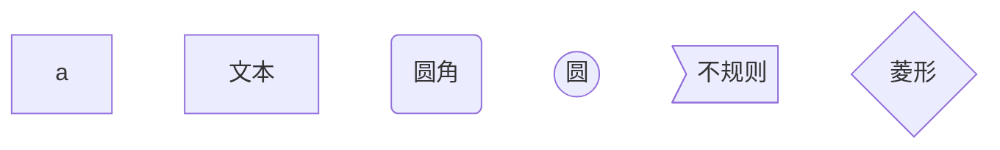

typora画图示例

<!--more-->

# 流程图
flow

```shell
st=>start: 开始|past:>https://xixhaha.gitee.io/blog/[blank]
e=>end: 结束
op1=>operation: 操作1
op2=>operation: 操作2
sub1=>subroutine: 子流程
cond=>condition: 判断1
c2=>condition: 判断2
io=>inputoutput: 输入输出

st->op1(right)->cond
cond(yes, right)->c2
cond(no)->sub1(left)->op1
c2(yes)->io->e
c2(no)->op2->e
```


```flow
st=>start: 开始|past:>https://xixhaha.gitee.io/blog/[blank]
e=>end: 结束
op1=>operation: 操作1
op2=>operation: 操作2
sub1=>subroutine: 子流程
cond=>condition: 判断1
c2=>condition: 判断2
io=>inputoutput: 输入输出

st->op1(right)->cond
cond(yes, right)->c2
cond(no)->sub1(left)->op1
c2(yes)->io->e
c2(no)->op2->e
```

# 序列图
sequence

```sequence
A->B: 请求?
Note right of B: 备注
B-->A: 响应
```

# mermaid

## 方向

graph tb


1. TB（ top bottom）表示从上到下
2. BT（bottom top）表示从下到上
3. RL（right left）表示从右到左
4. LR（left right）表示从左到右

## 节点

有以下几种节点和形状：

1. 默认节点 A
2. 文本节点 B[bname]
3. 圆角节点 C(cname)
4. 圆形节点 D((dname))
5. 非对称节点 E>ename]
6. 菱形节点 F{fname}




## 连线

节点间的连接线有多种形状，而且可以在连接线中加入标签：

1. 箭头连接 A-->B1
2. 开放连接 A---B2
3. 标签连接 A3-->|text|B3
4. 虚线-.-
5. 粗线==

 ```mermaid
graph TB
A-->B1
A---B2
A3-->|text|B3
A1===B4
A1==>B5
 ```

