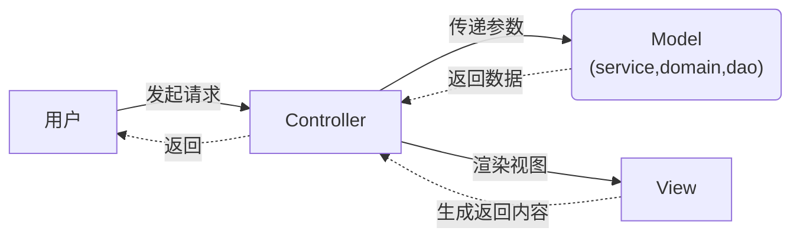
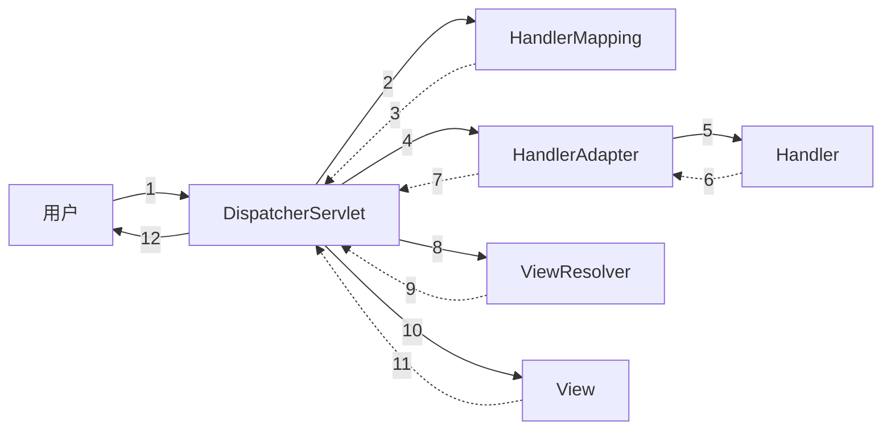

springMVC发起一次请求到返回的流程

<!--more-->

# MVC




# springMVC




序列图

```sequence
用户->DispatcherServlet:Request
participant DispatcherServlet
DispatcherServlet->HandlerMapping: 查找Handler
HandlerMapping-->DispatcherServlet:Handler
DispatcherServlet->HandlerAdapter:执行Handler
HandlerAdapter->Handler:调用
Handler-->HandlerAdapter:ModelAndView
HandlerAdapter-->DispatcherServlet:ModelAndView
DispatcherServlet->ViewResolver:查找View
ViewResolver-->DispatcherServlet:返回View
DispatcherServlet->View:渲染视图
View--DispatcherServlet:返回内容
DispatcherServlet-->用户:response
```


## DispatcherServlet

doDispatch方法是所有请求的入口

## HandlerInterceptor

拦截器链

doDispatch里分别有3个调用对应了HandlerInterceptor里的三个方法

mappedHandler.applyPreHandle-->preHandle

mappedHandler.applyPostHandle-->postHandle

processDispatchResult-->afterCompletion

```java
if (!mappedHandler.applyPreHandle(processedRequest, response)) {
	return;
}
// Actually invoke the handler.
mv = ha.handle(processedRequest, response, mappedHandler.getHandler());
mappedHandler.applyPostHandle(processedRequest, response, mv);
processDispatchResult(processedRequest, response, mappedHandler, mv, dispatchException);
```

## HandlerMapping

规定了url和handler的对应关系

## HandlerAdapter

相当于handler的代理类，由他调用handler，可以在调用前对参数做一些处理，也可以在调用后，将返回值按照特定的格式进行封装

## Handler

具体处理业务的类，大部分情况就是我们说的controller

## ViewResolver

根据指定的规则通过名称找到视图对象

## View

最终的视图，系统处理后产生的model对象输出到Response里面

```java
void render(@Nullable Map<String, ?> model, 
            HttpServletRequest request, 
            HttpServletResponse response)
    throws Exception;
```

