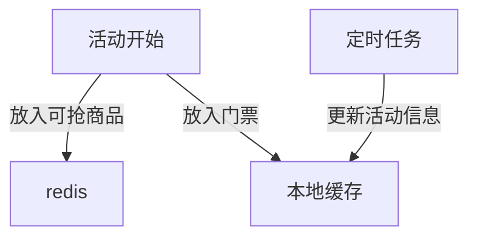

秒杀是一种典型的高并发场景，大量用户会在同一时间访问系统，网站流量激增。但库存一般都是有限的，许多用户的请求基本无效，如果如何将用户请求拦截在关键节点之外，是系统设计的关键。从页面到数据库，系统的请求数量应该是一个漏斗的形状

<!--more-->

# 整体流程

```flow
st=>start: 开始
op0=>operation: 进入队列
queue=>condition: 队列未满
op=>operation: 查询本地缓存
op1=>operation: 操作reids
op2=>operation: 操作数据库
search1=>condition: 验证门票
search2=>condition: 活动状态
lock=>condition: 获得商品ID
db=>condition: 更新商品
e=>end: 抢购完成
e1=>end: 活动未开始/结束
e2=>end: 库存不足
e3=>end: 排队
sec=>condition: 计划任务
st->op0->queue
queue(yes)->op(buttom)
queue(no)->e3
op->search1
search1(yes)->search2
search1(no)->e3
search2(yes)->op1(right)->lock
search2(no)->e1
lock(yes)->op2->db
lock(no)->e2
db(yes)->e
db(no)->e2

```

# 缓存初始化和更新



